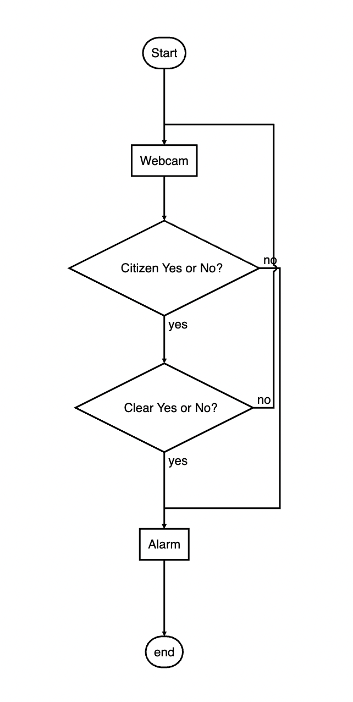
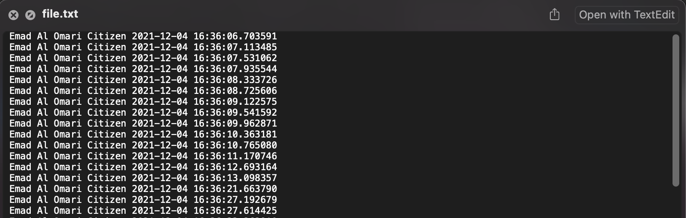

## Facial Recognition System
The system has been built to be a web application to be used on different platforms using any internet browser, another advantage to be developed as webapp is to be scalable as a mobile application for Android and IOS.

## Installation

The requirements of the app:
- python 3.6+
- opencv
- pandas
- numpy
- Flask
- face_recognition
- dlib
- date
## Introduction

The logic of the system can be explained in figure 1, the output from the camera will be an input for our system. The system has a comparison fed by two datasets.
If the face in the input picture is similar to one of the pictures in the criminal dataset, the face in the screen will be bounded with a red box. If the system recognizes a clear person the face in the screen will be bounded with a green box, and if it is unknown (not in the database), the box will be blue.

Two log folders are used to track the detections, one as a text file with the names followed with the date and the time, and another folder for the log images.

## Files Descriptions

The files structure is arranged as below:

    - Project Folder
    
    | - README.me
    |
    | - citizen_database
    | |- barack.jpeg
    | |- elon.jpeg
    | |- emad.jpeg
    | |- jeff.jpeg
    |
    | - criminal_database
    | |- elchapo.jpeg
    | |- escobar.jpeg
    |
    | -CSV
    | |- citizen.csv
    | |- criminal.csv
    |
    | - image log
    | |the pictures captured from the system
    |
    | - templates
    | |= index.html
    |
    | - text_log
    | | file.txt
    |
    | - main.py
    |
    | - camera.py
    |
    | - haarcascade_frontalface_alt2.xml

Where the main folder contains the main files and folders with the following description: 
1. "main.py": the main file that has the routes for the webapp.
2. "camera.py": this file is responsible for the facial recognition task.
3. "haarcascade_frontalface_alt2.xml": is a model for face detection.
4. "citizen_database": the folder that contains the citizen pictures.
5. "criminal_database" the folder that contains the criminal pictures.
6. "image log": the folder that contains the captured pictures from the webapp.
7. "text_log": the folder contains "file.txt" file, which is receives the names and the time from the application.
8. CSV: contains csv files about the pictures of the people.

## Datetime

While date and time are not distinct data types in Python, a module named datetime can be loaded to work with both the date and time. Because Python includes the Datetime module, there is no need to install it outside.

The Python Datetime module contains classes for manipulating date and time. These classes include various functions for manipulating dates, times, and time intervals. Because date and datetime are objects in Python, handling them involves manipulating objects rather than strings or timestamps.
We used Datetime module to write the time and the date of the recognized face in a text file.

## Tables

### Criminal Table:
                    
| Left-Aligned  | Center Aligned  | Reason |
| :------------ |:---------------:| -----:|
|Elchapo|12| Wanted To DEA|
| Paplo Escobar| 13  |   Wanted To DEA |

### Citizens Table:
Name  | ID
------------- | -------------
Emad Al Omari  | 11
Barack Obama | 12
Elun Musk | 13
Jeff Bezos | 14

## Instructions

To execute the app follow the instructions:
-----
1. Run the following command in the app's directory to run your web app.
    `python main.py`

2. Go to http://0.0.0.0:5000/

-----

